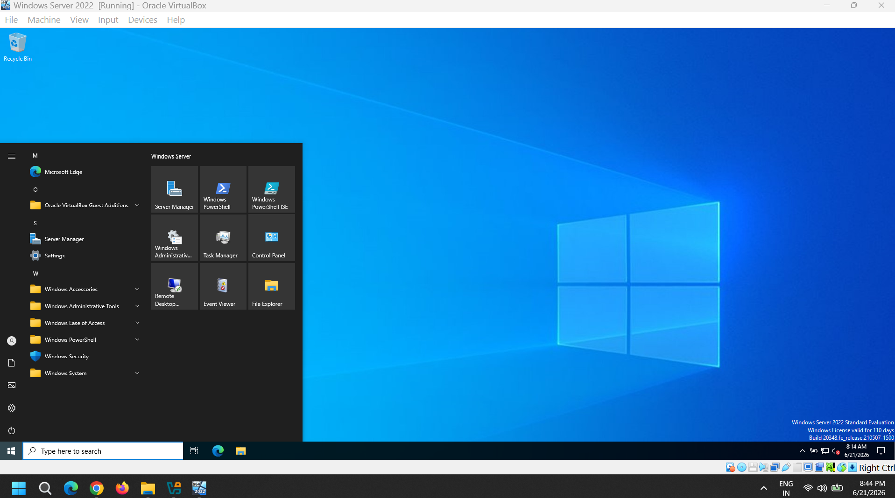

# Oracle VirtualBox Server Setup

- Download Oracle VirtualBox Windows Host from offcial site [https://www.virtualbox.org/wiki/Downloads](https://www.virtualbox.org/wiki/Downloads)

- Download Windows Server 2022 from Microsoft Evaluation Site [https://www.microsoft.com/en-us/evalcenter/evaluate-windows-server-2022](https://www.microsoft.com/en-us/evalcenter/evaluate-windows-server-2022)

- Download Windows 11 from Microsoft site while setup choose Windows 11 pro. This will be used as client computer. [https://www.microsoft.com/en-us/software-download/windows11](https://www.microsoft.com/en-us/software-download/windows11)

- Open Oracle VirtualBox. Click on 'New' Tab on hompage of VitualBox. Here we can select the location of VM which should be saved in separate drive from C so that it does not impact host OS slowness. Then we select the ISO image file. After this we can confirgure and assign hardware resources from host to VM **(Always choose to tick Skip Unattended Installation.)**.

Here are snaps of VirtualBox setup with my Server 2022 and Windows 11 Pro configuration:

## Extending Windows Server 2022 Trial for 3 Years and Ignoring Windows 11 License

- Open CMD and enter **' slmgr.vbs /rearm '** to extend it for 1 year and this command can be used 3 times hence extending it to 3 years.

- Verify the same using **' slmgr.vbs /xpr '** which will give expiry date.

- **' slmgr.vbs /dlv '** gives current license state.

- **' slmgr.vbs /ato '** syncs License to Microsoft Server.

- While installing Windows 11 it will ask for product key, select "I do not have a product key". Without valid licese some basic functions like changing wallpaper will not be working and may leave a watermark to activate license. Other than this no big issues to run this LAB.

## Configuration of Networks in VirtualBox

- While working on AD like adding roles and feature we need static IP and at the same time we need internet to work inside our VM from host network connection. To achieve this we set 2 Network Adapters for Windows Server VM.

Adapter 1: NAT (Wll be confirgured for AD for Static IP need, Explained in LAB 2)
Adapter 2: Internal (Will be used for network connectivity for VM from host)

- For Client VM do not put NAT adpater, only one that is Internal.

