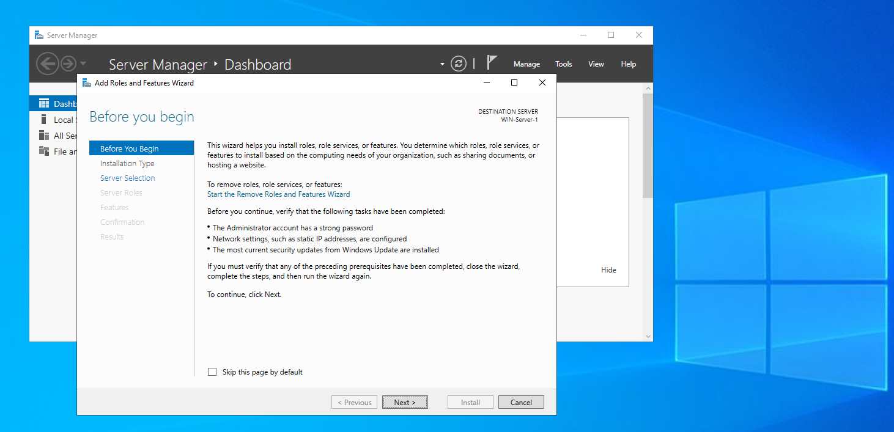
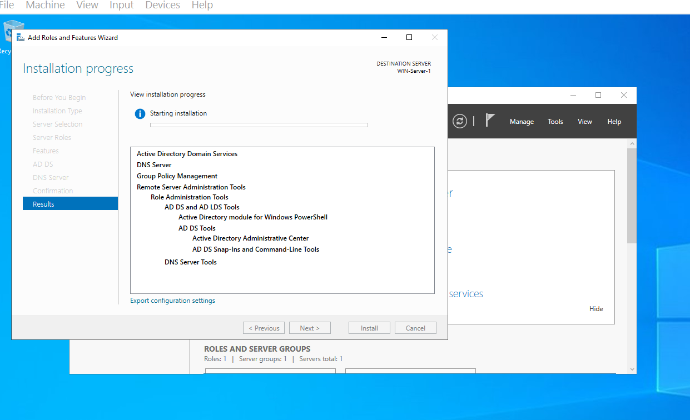
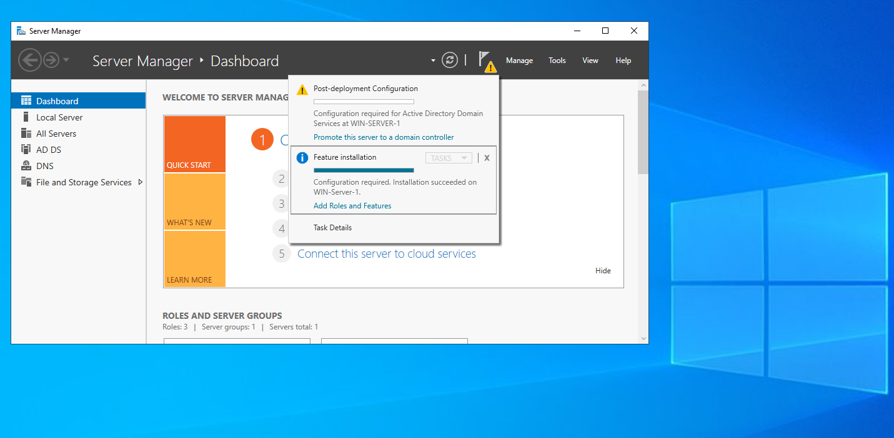
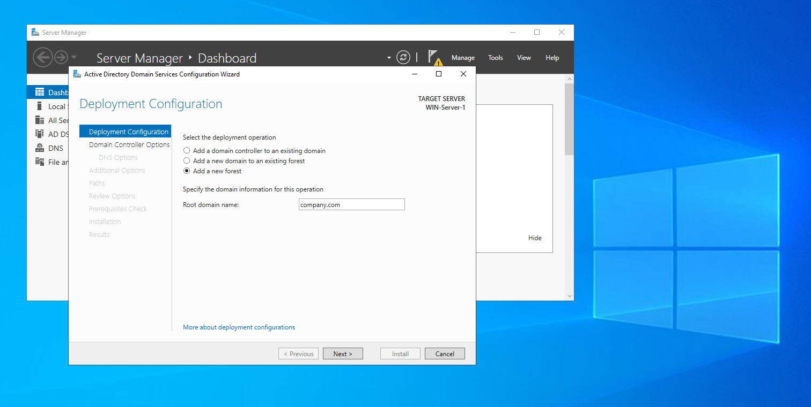
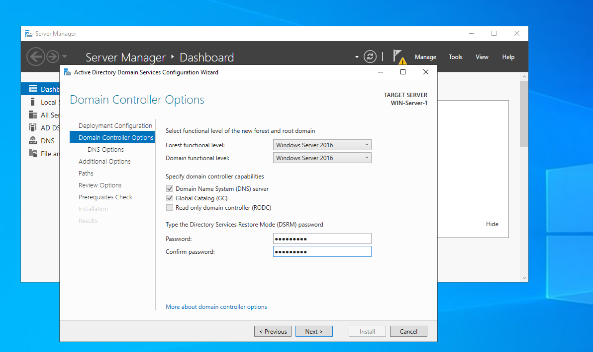
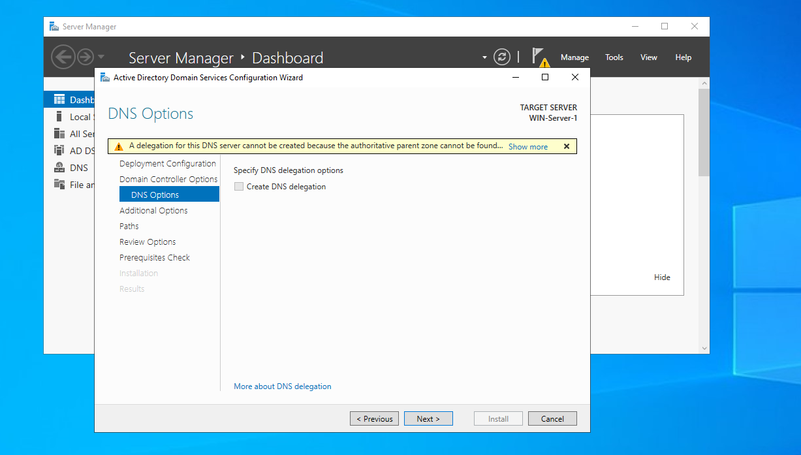
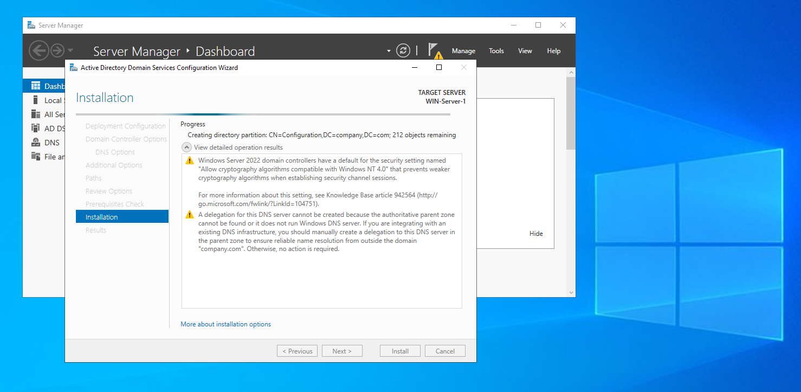
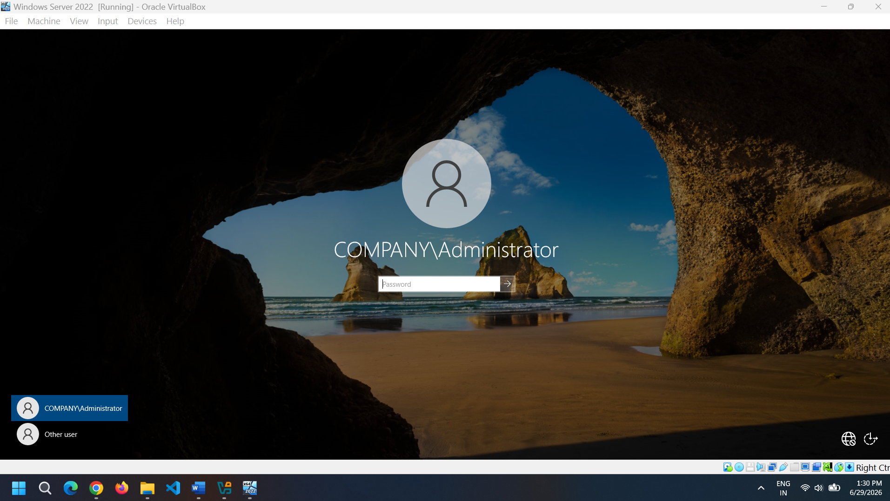
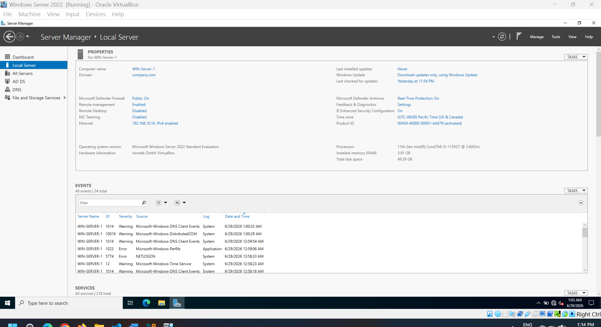

# Creating a Forrest

-

## Step 1: Click on 'Add Roles and Features'

Here we will get few suggestion to check for and most important is configuration of static IP

To configure static IP inside Oracle we need to follow these:

- Open Network Connections in Control Panel, run > ncpa.cpl

- Select the 2nd network adapter (That we slected as Internal Network in Oracle VirtualBox) and go to its properties. Click on IPVP4 and go to its properties. Switch the toggles from "Obtain automatically" to manual configurations. Use **192.168.10.10 for IP address**, **255.255.255.0 for Subnet mask** and **127.0.0.1 for Preferred DNS server**.

## Step 2: Installation Type and server selection

Here are 2 Options

- Role based or Feature based installation: For now I will go with this type

- Remote Desktop Services Installation

After this list of server with assigned IP will show to select, Click on Next. If the IP shows here is different than what we set, just cancel and go back to refresh Server Manager and try again.

## Step 3: Selecting roles to install

Here we need to add the required roles to setup in the server

- Active Directory Domain Services

- DNS Server

Rest we can go with by default and clicked Next to install. In confirmation page we can tick the option to restart if needed while installation so that it does not asks to restart server if needed while installation.

## Step 4: Promoting to Domain Controller

After installation there will be notification on the flag icon that feature installations are complete. Along with this there wil be an option to promote this server to domain controller in Post-deployment configuration. Click on it. Now we will create forest inside it.

## Step 5: Deployment Operations

There are 3 deployment operations

1. Add a domain controller to an existing domain
2. Add a new domain to an existing domain
3. Add a new forest

We do not have a exiting domain so will go with adding a new forest. I take a name as company.com

After creating it will show domain controller options, keep those as it is but set a DSRM password. The ***Directory Services Restore Mode*** used only when the Domain Controller is booted into Directory Services Restore Mode for maintenance or disaster recovery.

Also leave next DNS Options as it is for current lab.

After these, I can see my created forrest name as ***NetBIOS domain name***: company

## Step 6: Path, Review and Installation

- The default database path for AD DS is **C:\Windows\NTDS**. So the main file is stored inside NTDS folder of C drive by default.

- After this a pre-requisite check will begin. There will be few warnings but in the end it gets completed succesfully. Now click install to begin installation.

## Step 7: Reboot and computer is now logged in to forest profile

After all steps now system will ask to reboot. After few mins it logs to forest. Same server password here will work.

We have now created successflly a primary domain and forest. Verify the same by clicking on Local Server:

