# Adding Client Computer to Domain

Whenever we add a computer to a domain we have 3 types of users

- Local Admin: Computer local user without domain (Once computer is connected to domain and we need to login as local admin then we use .\)
- Domain User: A user defined on Server to logon
- Domain Admin: Server Master User ID and Password

## Creating a New User

- Open "Active Directory Users and Computers" from Server Manager of directly by searching on windows search.

- Navigate to "Users" under our defined domain. I will have many pre-defined users and groups which we will see later. Right Click on free space > New > User. We set out user as Shreenath Jay. Use same as logon name.

- Click Next, set a password and remember it for later use. We generally select 'Change Password in next logon' but for lab we use 'Password Never Expires' as we will be using the client computer.

- Do verify the user is part of our company domain, right click on newly created user, select proprertis and navigate to "Memeber of". There we will see by default user is part of company domain.

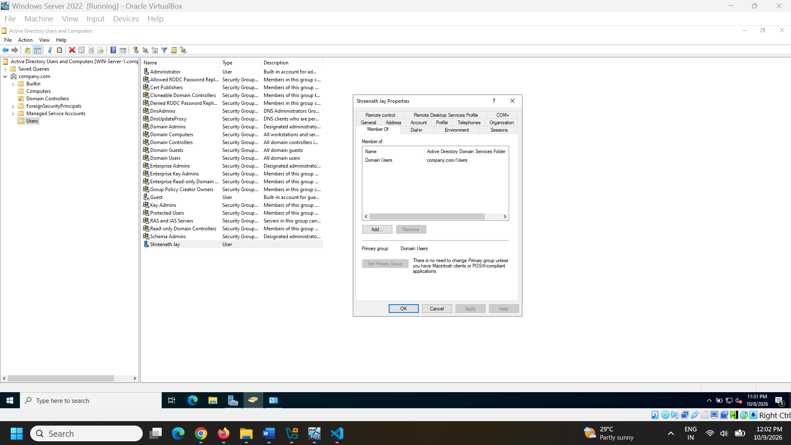

## Adding Computer to Domain

Currently our client computer is in Workgroup. To verify this we open run > sysdm.cpl

First we need to assign Client IP as per Server IP as follows

Server IP: 192.168.10.10
Server Subnet: 255.255.255.0
Server DNS: 127.0.0.1

Client IP: 192.168.10.20 (We have to keep same series as Server)
Client Subnet: 255.255.255.0 (Same as Server)
Client DNS: 192.168.10.10 (We have to keep this same as Server IP)

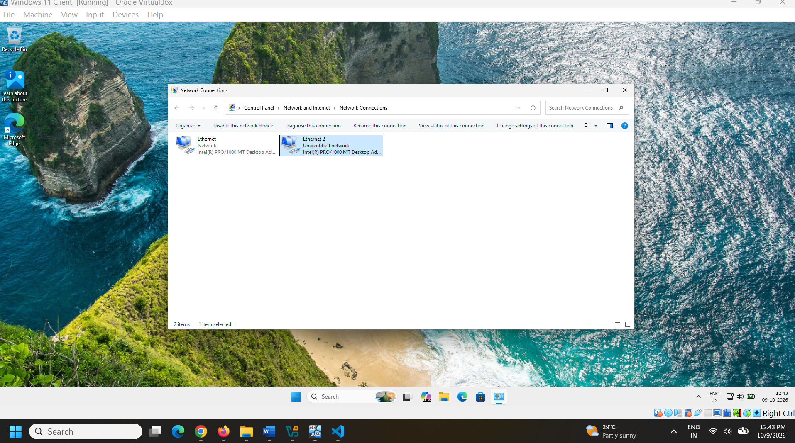

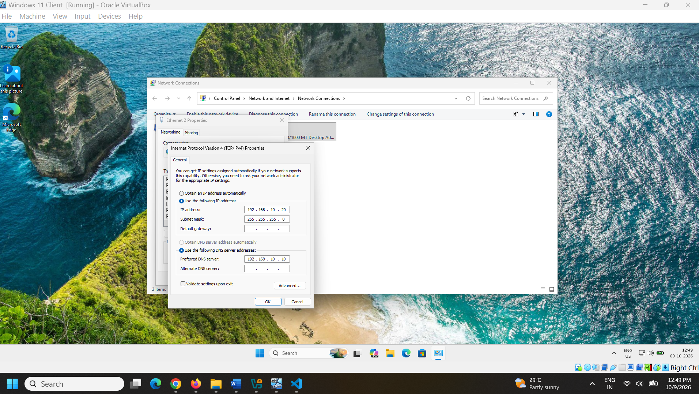

To test if Client connecting to Server, open CMD from Client and ping server IP

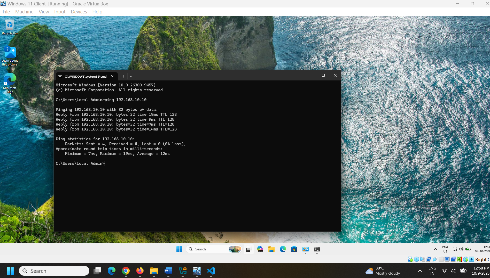

Now we open run > sysdm.cpl to open system properties

Click on 'Change' and it will open a tab giving option to chnage computer name and to select domain.

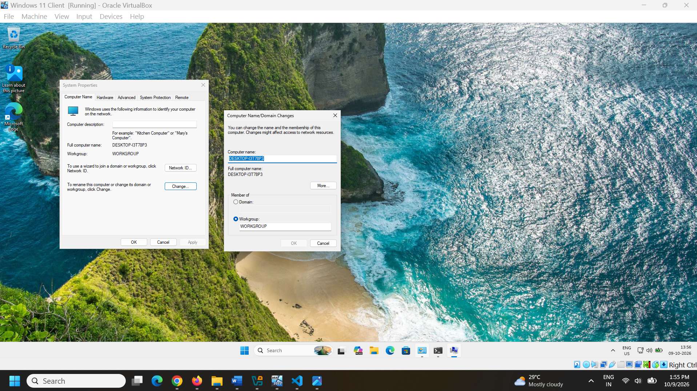

Now enter the domain name i.e. company.com, after this it will prompt to enter server credentials. We will also change the computer name to something used in real corporate like some code with serial number etc. We take CWL-223j34-J (CWL stands for Company Workstation Laptop, 2nd part a dummy serial number, and 3rd part lets say Jaipur)

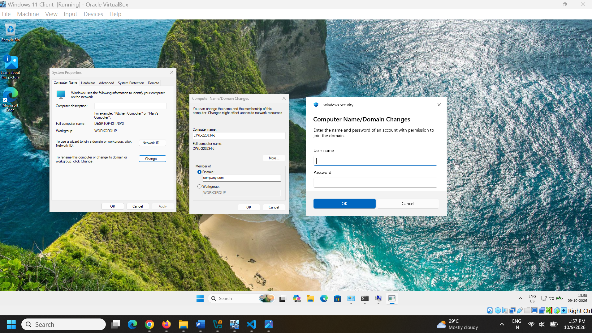

Welcome to company.com

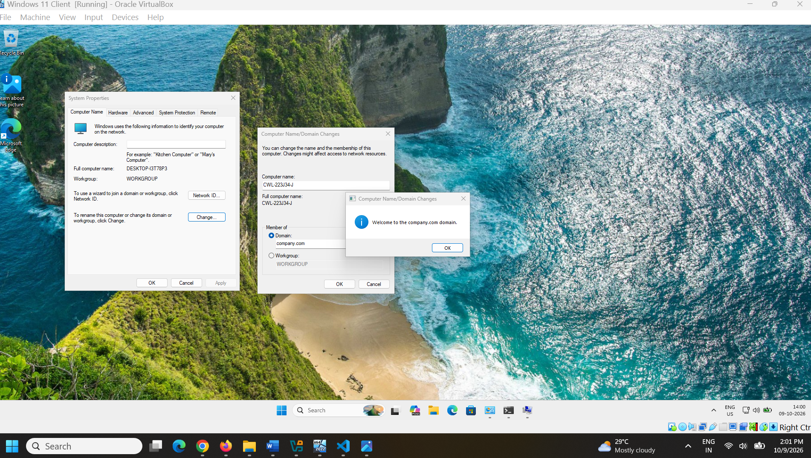

Restart is required to apply these changes. After restart we can see the client computer CWL-223j34-J inside computers folder in AD Users and Computers.

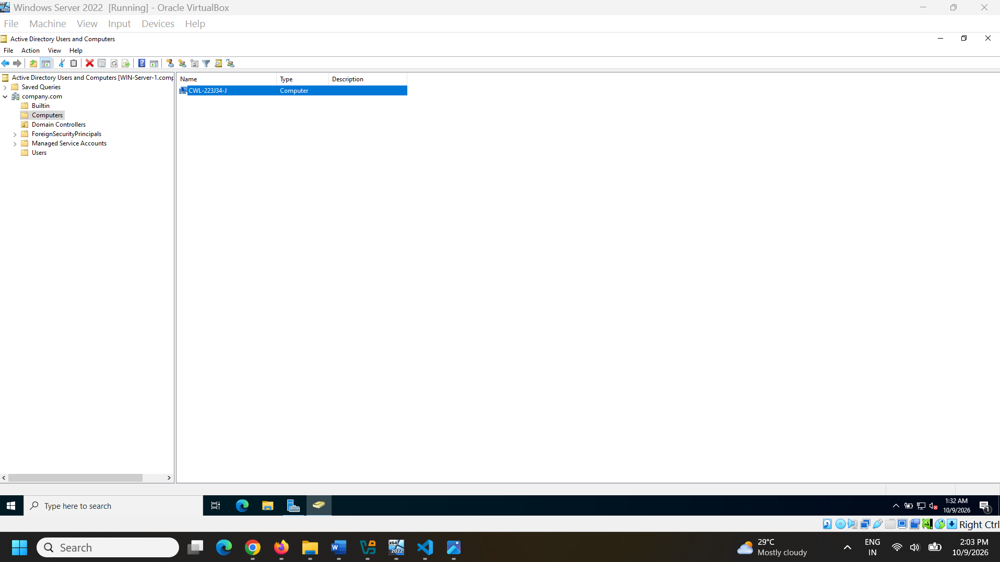

After Client PC restart domain check:

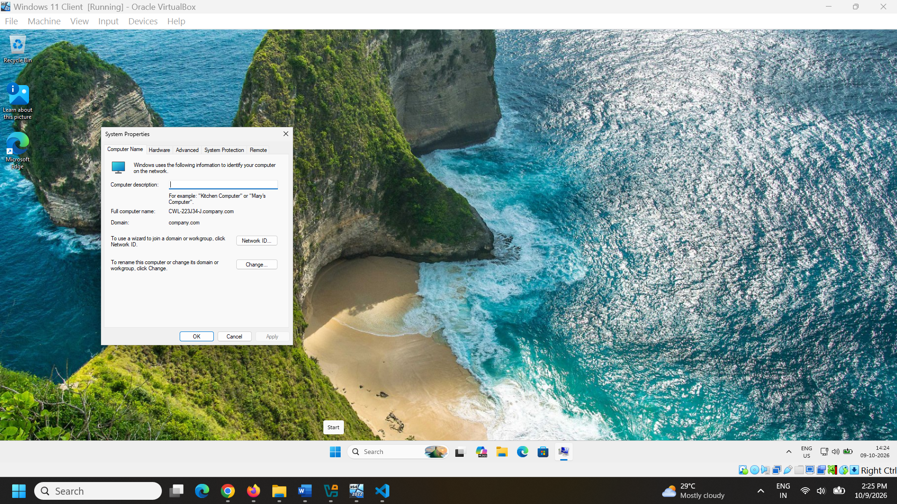

## Assigning the Client Computer to User

Visit AD Users and Computers, Navigate to computers and search for the computer name i.e. CWL-223j34-J, right click and click on Properties. Go to 'Managed By' tab.

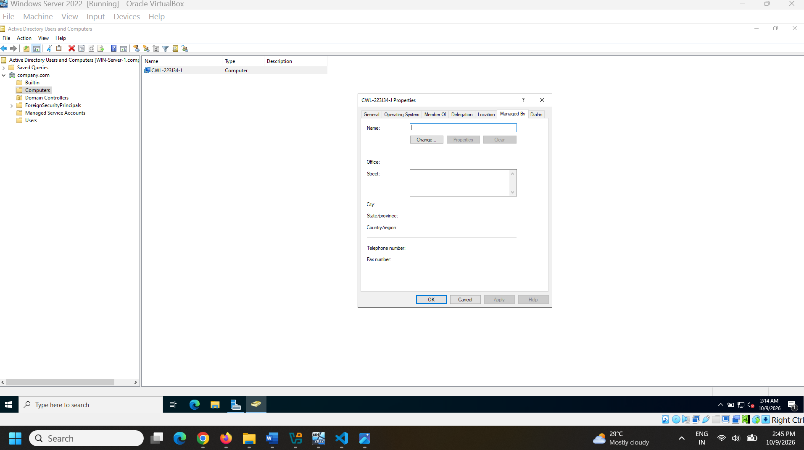

Click on Change, Type user name (Shreenath Jay) on 'Object Name' space and click on 'Check Names'. After this if entered correct name it will be underlined and highlighted. Click Ok and Apply. Now user Shreenath Jay has been assigned to CWL-223j34-J.

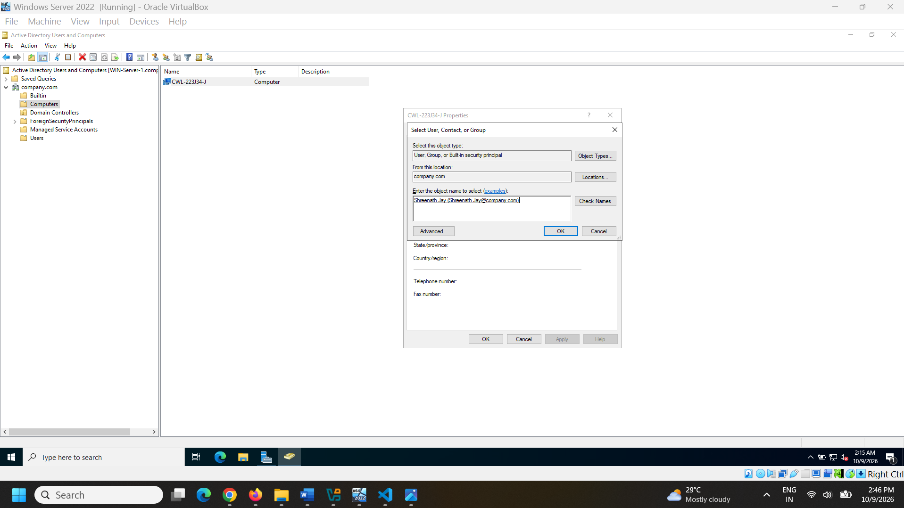

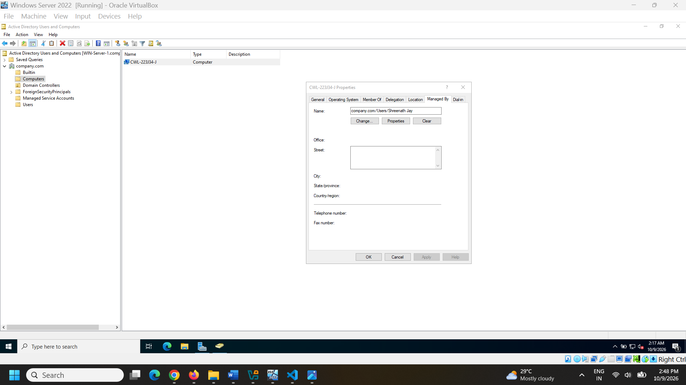

## Logging in to Client (CWL-223j34-J) as Created User i.e. Shreenath Jay

Use 'Other User' option while signing in. User Username: Shreenath Jay with set Password during creation.

Welcome Shrenath Jay to your workstation !

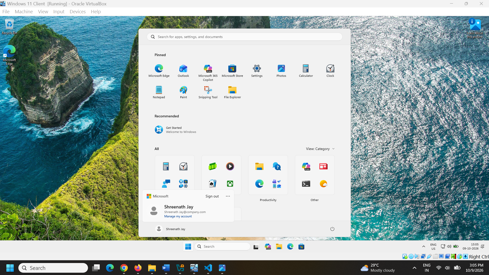
